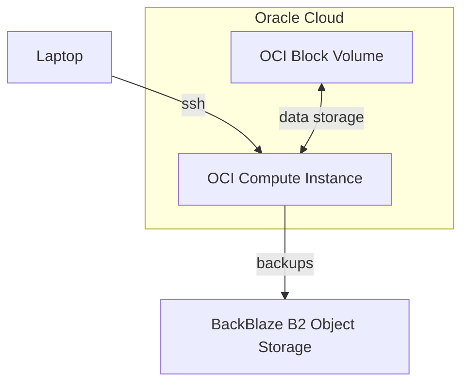

# Usage
1. Create a hosts file in `inventory/hosts`. It should look like:

```
[production]
<some ip or FQDN>
```
2. Install docker: `ansible-galaxy collection install community.docker`


To run commands, use `ansible-playbook -e @secrets_file.enc --ask-vault-pass -i inventory/hosts <playbook_name>.yml`




## Secrets
To add a new secret, run `ansible-vault edit secrets_file.enc`.

## Dependencies

```bash
python3 -m pip install --user pipx
python3 -m pipx ensurepath
pipx install --include-deps ansible --force
ansible-galaxy collection install community.docker
```
